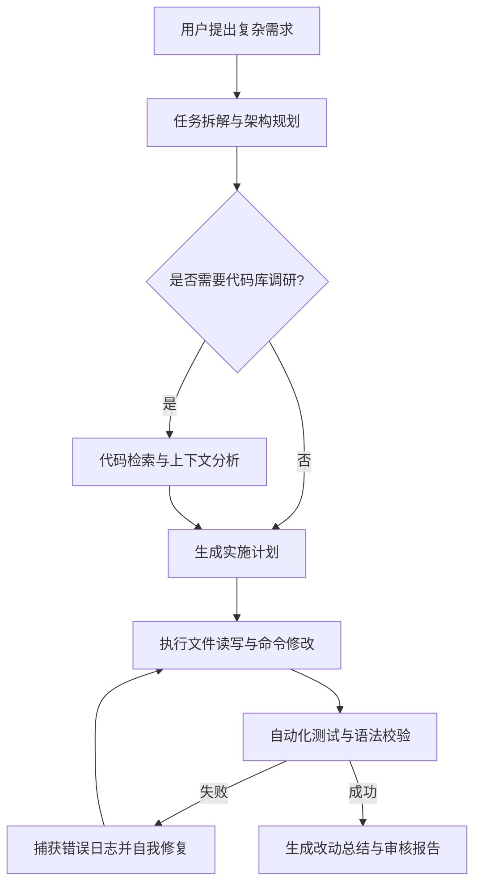

在 2026 年的今天，AI 辅助开发已经从最初简单的「代码补全（Copilot 模式）」彻底演进为**「自主智能体协作（Agentic Workflow 模式）」**。

过去我们只是把 AI 当作查阅语法的加强版搜索引擎；而现在，一个配置得当的 AI Agent 能够理解整套工程上下文、自主分析代码仓库、规划多步重构方案、编写测试用例并完成自动化校验。

本文结合我近期的实际工程落地经验，详细拆解如何搭建一套高可用、低幻觉的 AI Agent 研发协作工作流。

<!-- more -->

## 1. 协作范式的演进：从单轮 Prompt 到 Agent 协同

传统的一问一答模式在面对复杂业务逻辑时极容易遭遇「幻觉」和「上下文丢失」。现代 Agent 架构通过引入**感知（Perception）**、**规划（Planning）**、**工具执行（Action）**与**反思校验（Reflection）**形成了完整的反馈回路。



## 2. 核心四大支柱

### 2.1 上下文注入与代码理解 (Context Management)
Agent 能否给出精准改动的关键在于**高质量的上下文**。
- **项目结构与规范文件**：在根目录提供精准的规则文档（如 `CLAUDE.md`、`.cursorrules` 或 Agent 系统配置），声明运行命令、代码风格与目录约定。
- **按需检索而非全量灌入**：利用 AST 解析或高性能文本检索（如 ripgrep / fd）仅提取目标函数与调用链，避免消耗过多上下文窗口导致注意力分散。

### 2.2 规划先行 (Planning Mode)
面对跨越 3 个以上文件或涉及架构调整的需求，坚决执行「规划 - 确认 - 执行」三步走：
1. **Research 阶段**：只读分析，定位核心接口与影响面；
2. **Plan 阶段**：输出详细的技术实现文档（包含改动文件、接口设计、破坏性变更与回滚预案）；
3. **Execution 阶段**：按计划逐步编码，严禁无预案的盲目重构。

### 2.3 工具集集成 (Tooling Integration)
赋予 Agent 最小必要且安全的系统能力：
- 文件查看与精准行替换（避免大文件全量覆盖导致的缩进/格式破坏）；
- 本地构建与语法检查命令（TypeScript 类型检查、Linter、Unit Test）；
- 外部文档查询与 API 检索。

```bash
# 典型的自动化验证组合
npm run lint && npm run type-check && npm run test:unit
```

### 2.4 反思与闭环纠错 (Self-Correction Loop)
当构建或测试报错时，不要让人类开发者充当传话筒。将编译器的 stderr 直接反馈给 Agent，让其对照报错行号和调用栈自愈：

```javascript
// 示例：类型守卫与防御性代码重构
interface UserProfile {
  id: string;
  name: string;
  settings?: {
    theme?: 'light' | 'dark';
  };
}

// 优化前：可能抛出 TypeError
function getTheme(user: UserProfile) {
  return user.settings.theme;
}

// 优化后：Agent 自愈加入可选链与兜底默认值
function getThemeSafe(user: UserProfile): 'light' | 'dark' {
  return user.settings?.theme ?? 'light';
}
```

## 3. 常见避坑指南

1. **避免单次下达过于宏大的模糊任务**：将「重构整个用户模块」细化为「提取用户状态管理 Store」、「重构用户资料表单校验」等独立小步骤。
2. **保留人类掌控权（Human in the Loop）**：涉及数据库变更、生产部署和密钥管理的操作，必须设置人类二次确认机制。
3. **保持测试用例覆盖**：AI 写出的代码必须有单元测试做底线保障，测试是检验 Agent 输出质量的最佳试金石。

## 4. 总结与展望

AI 不会取代开发者，但**善用 AI Agent 的开发者正在以数倍的效率拉开差距**。将重复性的样板代码、繁琐的类型补齐和回归测试交给 Agent 处理，开发者才能将最宝贵的精力聚焦在核心架构设计、业务洞察与技术创新上。
