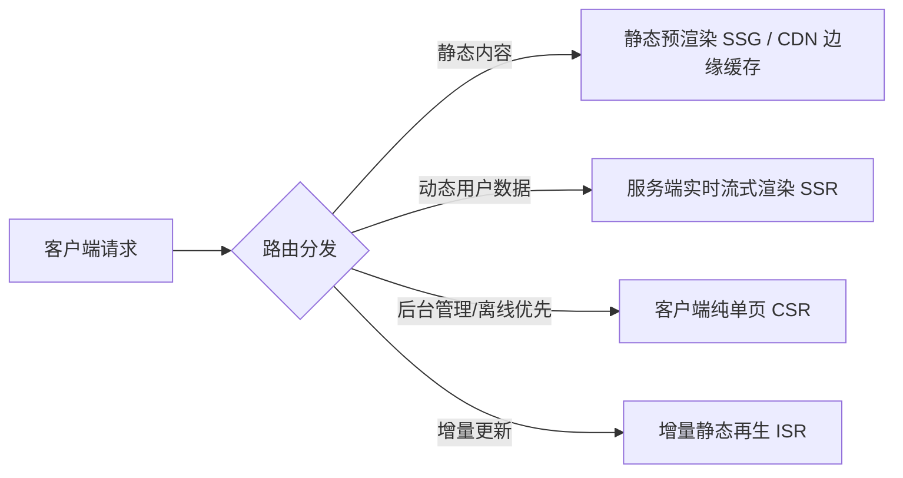

过去几年中，前端领域的技术栈经历了一场从「工具链堆叠」向「原生高性能编译」与「全栈边界融合」的深刻变革。

站在 2026 年的视角回望，前端工程化已经不再局限于单纯的打包与混淆，而是贯穿了<strong>开发体验（DX）、端到端类型安全（End-to-End Type Safety）、智能混合渲染（Hybrid Rendering）以及多包单体仓库（Monorepo）</strong>的全链路体系。

<!-- more -->

## 1. 构建工具链的原生化革命

随着基于 Rust 和 Go 编写的编译基建全面成熟，前端构建速度已经进入了毫秒时代：

| 构建工具 / 引擎 | 核心驱动语言 | 适用场景 | 关键优势 |
| :--- | :--- | :--- | :--- |
| **Vite / Rolldown** | Rust + C | 现代 Web 应用、组件库开发 | 基于 Rust 统一开发与生产打包逻辑，冷启动极速 |
| **Turbopack** | Rust | 大型 Next.js / React 全栈应用 | 增量计算与精细化函数级缓存 |
| **Biome / Oxlint** | Rust | 代码格式化与静态检查 (Linter) | 比传统 ESLint + Prettier 快 20-50 倍 |
| **esbuild / SWC** | Go / Rust | 底层转换器与单文件转译 | 极高并发的 AST 转译基石 |

```bash
# 采用现代化 Biome 一键完成格式化与 Lint
npx @biomejs/biome check --write ./src
```

## 2. 全栈融合与渲染范式的收敛

纯客户端单页应用（SPA）与重型服务端渲染（SSR）之间的非黑即白时代已经过去，如今的主流框架（Nuxt 3、Next.js、SvelteKit）均已支持细粒度的混合渲染：



- **边缘计算 (Edge Rendering)**：将轻量级 SSR 逻辑部署在靠近用户的 CDN 边缘节点，首屏 TTFB 降至 50ms 以内。
- **Isomorphic TypeScript**：前后端共享 Zod 校验 Schema 与 DTO 接口定义，杜绝因接口字段变更导致的运行时未捕获异常。

```typescript
import { z } from 'zod';

// 前后端共享的通用请求 Schema
export const CreateArticleSchema = z.object({
  title: z.string().min(1).max(100),
  tags: z.array(z.string()).default([]),
  published: z.boolean().default(false),
});

export type CreateArticleInput = z.infer<typeof CreateArticleSchema>;
```

## 3. Monorepo 与微前端工程治理

对于跨多项目的大型团队，pnpm workspace + Turborepo 已经成为现代 Monorepo 治理的标准答案：

```text
my-monorepo/
├── apps/
│   ├── blog/          # Hexo / Astro 静态站点
│   ├── web-portal/    # Vue / Nuxt 核心业务前台
│   └── admin-panel/   # React 中后台管理平台
├── packages/
│   ├── ui-components/ # 共享组件库
│   ├── utils/         # 共享工具库与格式化方法
│   └── tsconfig/      # 统一 TypeScript 规范
├── pnpm-workspace.yaml
└── package.json
```

```yaml
# pnpm-workspace.yaml 配置示例
packages:
  - 'apps/*'
  - 'packages/*'
```

## 4. 总结与实践建议

前端工程化的终极目标永远是：**让开发团队写得顺畅、让构建部署跑得飞快、让终端用户用得丝滑**。

在技术选型时，切忌盲目追求新奇名词，应始终紧扣团队规模与业务实际，优先引入能带来明显效率提升的现代化基础设施。
