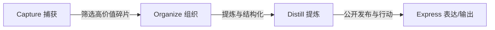

在信息爆炸的时代，我们每天被海量的碎片化资讯、短视频和推文包围。很多人常常陷入一种「收藏即学会」的心理安慰中，然而当真正需要调用知识解决问题时，却发现脑海中一片空白。

如何将外界的信息洪流沉淀为属于自己的「数字第二大脑（Second Brain）」？这是我近年来一直在实践和反思的核心课题。

<!-- more -->

## 1. 知识管理的底层模型：CODE 框架

知识管理专家 Tiago Forte 提出的 **CODE 模型**为知识流动提供了极为清晰的指引：

1. **Capture（捕获）**：只保留那些真正能引发共鸣、解决痛点或带来启发的 5% 优质信息，拒绝无脑收藏；
2. **Organize（组织）**：按**行动目标与项目（PARA 模型）**进行分类，而非按庞杂宽泛的学科分类；
3. **Distill（提炼）**：用自己的话重写要点，进行渐进式总结（逐层高亮与提炼）；
4. **Express（表达/输出）**：**没有输出的输入就像没有消化的食物**。通过写博客、做分享或开源项目将知识公之于众。

## 2. 从碎片笔记到博客长文的跃迁

很多初学者容易在「记笔记」本身花费过多时间（如折腾各种复杂的 Notion 联动模板），却忽视了最核心的**思考深度**。

我的建议是坚持**「极简纯文本原则」**：

- **日常速记**：手机便签 / Flomo 记录一句话灵感与闪念；
- **深度沉淀**：Obsidian 本地 Markdown 笔记，双向链接连接关联概念；
- **公开发布**：经过梳理和逻辑重组后，沉淀为 Hexo 博客文章。

> **费曼技巧（Feynman Technique）**：
> 如果你无法用通俗易懂的语言向一个外行解释清楚一个概念，说明你还没有真正理解它。写博客正是践行费曼技巧的最佳场所。

## 3. 抵抗完美主义：Done is better than perfect

很多人迟迟不敢公开发布自己的文章，总觉得自己写得不够深刻、代码不够优雅。

事实上：
- **每一篇稚嫩的记录都是未来成长的最好见证**；
- 哪怕只解决了一个极为具体的报错细节，在搜索引擎的另一端，也可能会为某个同样苦苦排查数小时的同行点亮一盏灯；
- 写作是一场长跑，**持续输出的复利效应**在 3 年、5 年后会带来超乎想象的质变。

## 4. 结语

保持热爱，奔赴山海。愿我们都能在这个浮躁的时代里，保留一块属于自己的安静自留地，认真思考，持续写作，见证时间的复利。
